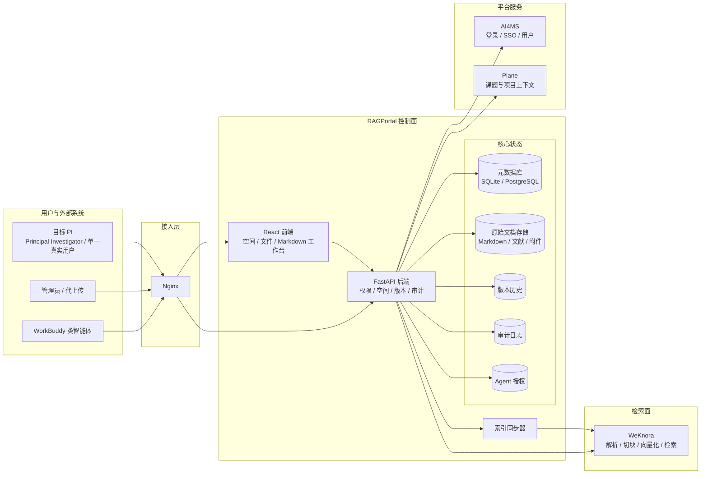
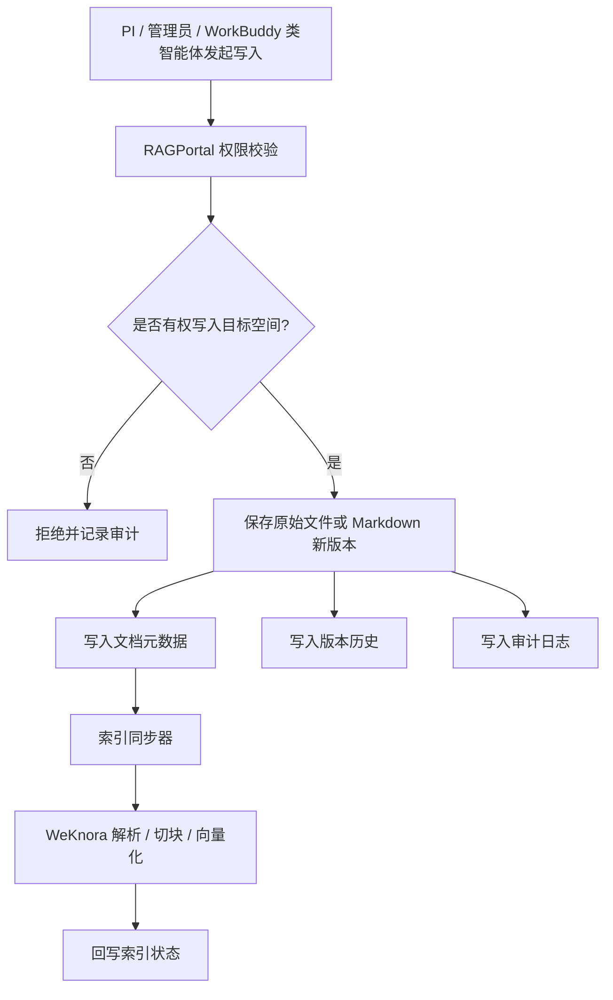
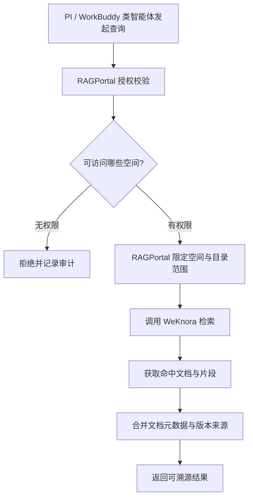

# PI(Principal Investigator)私有科研知识空间 PRD

| 项目 | 内容 |
|------|------|
| 文档日期 | 2026-09-24 |
| 产品名称 | RAGPortal PI(Principal Investigator)私有科研知识空间 |
| 文档类型 | 产品需求文档(PRD) |
| 当前项目 | RAGPortal |
| 主要服务对象 | 目标 PI(Principal Investigator)、平台管理员、WorkBuddy 类授权智能体 |
| 核心依赖 | AI4MS 身份体系、WeKnora 检索服务、Plane 研究项目上下文 |

## 1. 背景

### 1.1 术语约定

- **PI**:本文中的 PI 特指 **Principal Investigator**,即某一位真实的项目负责人。PI 是 AI4MS 中的一个具体人类用户,不是泛化的“研究人员”角色,也不是组织、课题组或系统账号。
- **目标 PI**:一期服务的对象是当前明确指定的某一位 PI。架构上可以预留多个 PI 空间并存的能力,但“支持所有 PI”不是一期验收目标。
- **WorkBuddy 类智能体**:指以 WorkBuddy 为参考接入方的智能体客户端。产品能力不应硬编码为只支持 WorkBuddy;类似 WorkBuddy 的外部智能体都应通过统一的 Agent 身份和独立凭据接入知识库。

### 1.2 现状

RAGPortal 当前定位是知识库文档上传门户,已经具备:

- 复用 AI4MS 登录与 SSO
- 拉取 WeKnora 知识库列表
- 上传 PDF、DOCX、Markdown 等文件
- 记录上传者、解析状态与研究项目 metadata
- 管理员查看、筛选与导出上传记录

目标 PI 提出了新的使用方式:

1. 需要一个自己的私有知识库空间,可以上传文献和资料;平台管理员在获得授权后也可以代他上传。
2. WorkBuddy 类智能体需要能够访问该知识库内容,为 PI 提供检索、问答与写作辅助。
3. PI 会像使用 Obsidian 一样频繁读写知识库,除文献外还会持续产生大量 Markdown 笔记。

这意味着 RAGPortal 不能只作为“上传入口”,而需要演进为 PI 的长期科研知识空间。

## 2. 问题定义

### 2.1 当前模式的限制

当前文件上传后主要由 WeKnora 保存与索引,RAGPortal 只记录上传状态。该模式适合一次性文档入库,但难以支撑以下需求:

- **私有空间边界不完整**:知识库列表主要由全局 WeKnora API Key 决定,RAGPortal 缺少自己的空间级成员与授权模型。
- **Markdown 高频读写能力不足**:当前系统缺少在线编辑、版本历史、冲突保护和目录化管理。
- **WorkBuddy 类智能体无法安全接入**:如果直接复用 WeKnora API Key,会绕过 PI 的空间权限边界。
- **原始文件不是系统资产**:如果 WeKnora 数据异常或后续更换检索引擎,缺少由 RAGPortal 主导的源文件与版本数据。
- **审计粒度不足**:需要区分空间 owner、实际操作者、代理上传者和外部 Agent。

### 2.2 要解决的核心问题

本 PRD 要解决的问题是:

> 如何基于现有 AI4MS、RAGPortal、WeKnora 和 Plane 组件,构建一个由目标 PI 拥有、可高频读写 Markdown、可安全接入 WorkBuddy 类智能体、可长期积累和导出的私有科研知识空间。

## 3. 产品目标

### 3.1 业务目标

1. 让 PI 拥有可长期积累的私有科研知识空间。
2. 支持文献、项目资料、组会记录、想法笔记和实验记录的统一管理。
3. 让 WorkBuddy 类智能体在受控授权下读取和使用 PI 的知识资产。
4. 保证知识内容可溯源、可导出、可回滚,避免被单一检索系统锁定。
5. 为后续课题组共享空间、项目空间和智能体生态打下基础。

### 3.2 用户目标

| 用户 | 目标 |
|------|------|
| PI | 作为单一真实用户获得私有、安全、可频繁读写、可检索、可导出的科研第二大脑 |
| 管理员 | 可在授权范围内协助 PI 上传和管理资料,且操作可追溯 |
| WorkBuddy 类智能体 | 可通过受控入口访问指定知识空间,并提供可溯源的回答 |
| 研发团队 | 在不重写现有系统的前提下渐进演进架构 |

### 3.3 成功指标

一期上线后应满足:

- PI 默认拥有独立私有空间,其他用户不可见、不可访问。
- 管理员代上传时,系统同时记录空间 owner 和实际操作者。
- Markdown 文件支持在线读写与版本历史。
- WorkBuddy 类智能体只能访问被授权的空间,且访问行为有审计记录。
- 检索结果能回溯到具体文档、版本或片段来源。
- 原始文件和元数据可以从 RAGPortal 导出。

## 4. 用户与场景

### 4.1 用户与外部系统角色

| 角色 | 说明 |
|------|------|
| PI / Space Owner | 目标 Principal Investigator,是单一真实人类用户;作为空间拥有者拥有最高管理权 |
| Space Member | 被授权访问空间的用户,可按只读或读写授权 |
| Platform Admin | 平台管理员,可在授权范围内代上传或协助管理 |
| Agent Principal | WorkBuddy 类外部智能体身份,通过独立凭据访问指定空间 |
| System Operator | 运维人员,负责备份、监控与索引重建 |

### 4.2 核心场景

#### 场景一:PI 建立个人知识空间

目标 PI 登录 RAGPortal 后,系统为其创建或绑定默认个人空间。该空间归属于这个具体用户,空间内可按目录组织文献、Markdown 笔记、项目资料和附件。

#### 场景二:管理员代 PI 上传文件

管理员协助整理资料时,可以在 PI 授权的空间内代上传文件。系统记录:

- 空间归属人是 PI
- 实际上传人是管理员
- 上传时间、文件来源、hash 与目标目录

管理员不使用 PI 的账号密码,也不改变文件的归属关系。

#### 场景三:PI 日常维护 Markdown 笔记

PI 在 RAGPortal 中创建、编辑、重命名和移动 Markdown 文件。系统保存每次内容变更,支持查看历史版本和回滚。若 PI 与 WorkBuddy 类智能体同时修改同一文件,系统不允许静默覆盖。

#### 场景四:WorkBuddy 类智能体检索知识库

PI 为 WorkBuddy 类智能体创建独立授权,指定其可访问的个人空间或子目录。智能体通过 RAGPortal 访问知识内容,RAGPortal 先校验授权,再调用 WeKnora 检索,并返回带来源信息的引用结果。

#### 场景五:WorkBuddy 类智能体写入受控笔记

WorkBuddy 类智能体生成会议纪要、文献摘要或思路草稿时,默认只能写入指定目录,例如 Agent 工作目录。正式笔记是否允许 Agent 修改,必须由 PI 显式授权。

#### 场景六:知识库导出与迁移

PI 可以导出整个空间的原始文件、目录结构和必要元数据。导出结果应保持 Markdown 与附件的相对关系,便于继续在 Obsidian、VS Code 或其他工具中使用。

## 5. 产品范围

### 5.1 一期范围

一期目标是完成最小闭环:

1. 私有空间模型
2. 空间成员与基础权限
3. 原始文件由 RAGPortal 保存
4. Markdown 在线读写
5. 文档元数据与版本记录
6. WeKnora 索引状态同步
7. WorkBuddy 类智能体只读授权与检索链路
8. 基础审计日志

### 5.2 二期范围

二期增强知识工作台能力:

1. WorkBuddy 类智能体受控写入
2. 目录树管理
3. 标签与 frontmatter 解析
4. 全局搜索与过滤
5. 版本 diff 与回滚
6. 空间导出
7. 课题组共享空间与项目空间

### 5.3 三期方向

三期可逐步建设 Obsidian 化体验:

1. 双链与反向链接
2. 文档图谱
3. 更细粒度的目录授权
4. 文献笔记与文献原文关联
5. 与 Plane 课题节点深度联动
6. 多智能体访问策略与配额管理

### 5.4 非目标

当前版本不包含:

- 修改 AI4MS 主账号体系
- 重写 WeKnora 内部向量化与检索实现
- 直接暴露 WeKnora API Key 给任何外部系统
- 实时多人协同编辑
- 自动代替 PI 修改正式论文或结论文档
- 复杂组织架构与细粒度 ACL 管理后台

## 6. 总体架构

### 6.1 架构定位

整体架构采用“控制面 / 数据面 / 检索面 / 身份面”分离:

- **身份面**:AI4MS 负责登录、SSO、用户身份与基础角色。
- **控制面**:RAGPortal 负责空间、权限、文档元数据、版本、审计与 Agent 授权。
- **数据面**:RAGPortal 管理原始 Markdown、文献、附件与目录结构。
- **检索面**:WeKnora 负责文档解析、切块、向量化和检索执行。

### 6.2 架构图



### 6.3 核心架构原则

1. **AI4MS 管身份**
   RAGPortal 不重复建设账号密码体系,继续复用 AI4MS 的用户与角色信息。

2. **RAGPortal 是权限边界**
   用户和 Agent 能访问哪些空间、能读还是能写,均由 RAGPortal 判定。WeKnora 不直接对外。

3. **原始文件归 RAGPortal 保存**
   RAGPortal 的文档存储是 source of truth。WeKnora 中的索引是可重建的派生数据。

4. **WeKnora 负责检索执行**
   继续复用 WeKnora 的解析、切块、向量化和搜索能力,一期不引入新的向量数据库。

5. **WorkBuddy 类智能体不直连 WeKnora**
   WorkBuddy 类智能体使用独立授权访问 RAGPortal,由 RAGPortal 代理检索与读写。

6. **版本先于索引**
   文件变更先落入 RAGPortal 的原始存储与版本历史,再触发索引更新,避免只更新索引而丢失源数据。

7. **审计贯穿读写链路**
   人类用户、管理员、代理上传者和 Agent 的关键操作都应记录操作者、授权者、目标对象与结果。

## 7. 数据流

### 7.1 写入与索引流程



写入流程必须满足:

- 权限校验失败时不产生任何数据变更。
- 文件内容变更成功后,元数据、版本与审计信息保持一致。
- 索引失败不影响源文件保存,用户可看到索引失败原因并重试。
- 内容 hash 未变化时避免重复索引。

### 7.2 查询流程



查询结果应至少能追溯:

- 所属空间
- 文档标识
- 文档标题或路径
- 命中片段
- 版本或更新时间
- 前端可跳转的来源位置

## 8. 功能需求

### 8.1 私有空间

#### FR-SP-01 默认个人空间

系统应为目标 PI 自动创建个人空间。个人空间默认只有该 PI 可访问。

#### FR-SP-02 空间隔离

用户默认只能看到自己有权限的空间。未授权空间不得出现在列表、搜索结果、统计页面或 API 返回中。

#### FR-SP-03 空间类型

一期优先支持个人空间。数据模型设计应预留共享空间与项目空间能力。

#### FR-SP-04 空间与 WeKnora KB 映射

RAGPortal 空间可以映射到一个或多个 WeKnora KB。映射关系由 RAGPortal 维护,权限判断不依赖 WeKnora 的全局 Key 可见范围。

### 8.2 成员与授权

#### FR-PERM-01 空间角色

一期至少支持:

- Owner:空间拥有者
- Editor:可读写
- Viewer:只读
- Agent:智能体身份,可按只读或读写授权

#### FR-PERM-02 管理员代操作

平台管理员可以在获得授权后代 PI 上传或管理文件,但必须记录实际操作者身份。

#### FR-PERM-03 禁止账号共享

任何用户不得通过共享 PI 账号密码的方式完成代上传或系统访问。

#### FR-PERM-04 Agent 独立凭据

WorkBuddy 类智能体使用独立 Agent 凭据访问 RAGPortal,不得复用 PI 登录态或 WeKnora 全局 API Key。

#### FR-PERM-05 授权撤销

PI 或平台管理员可以撤销 Agent 授权。撤销后原凭据立即失效。

### 8.3 文档与 Markdown 管理

#### FR-DOC-01 文件上传

支持上传文献、资料、Markdown 与附件。上传时必须选择目标空间和目录。

#### FR-DOC-02 原始文件保存

RAGPortal 必须保存原始文件内容,并在元数据中记录文件类型、大小、hash、路径和上传者。

#### FR-DOC-03 Markdown 在线编辑

支持创建、编辑和保存 Markdown 文件。编辑体验以稳定、克制、适合长时间使用为主,不追求复杂富文本功能。

#### FR-DOC-04 目录管理

支持基础目录树浏览、创建目录、重命名和移动文件。目录结构应保持可导出。

#### FR-DOC-05 版本历史

每次内容变更生成版本记录,包含内容 hash、操作者、时间和变更说明。

#### FR-DOC-06 冲突保护

更新文件时必须携带期望版本。若服务端版本已变化,返回冲突,不允许静默覆盖。

#### FR-DOC-07 版本回滚

用户可以查看历史版本,并将某个历史版本恢复为新版本。回滚本身也进入版本历史。

#### FR-DOC-08 内容导出

支持导出空间原始文件、目录结构与基础元数据。导出结果应保持 Markdown 与附件的相对路径关系。

#### FR-DOC-09 删除保护

删除文件或目录时应记录删除者与删除时间。重要数据可先进入回收站或软删除状态。

### 8.4 检索与溯源

#### FR-RAG-01 空间内检索

用户只能在自己有权限的空间内发起检索。

#### FR-RAG-02 混合检索

一期优先复用 WeKnora 检索能力,返回语义检索结果。二期可补充文件名、标题、标签和路径的关键词检索。

#### FR-RAG-03 索引状态展示

文档应显示索引状态,例如待索引、索引中、成功、失败。

#### FR-RAG-04 索引重试

索引失败后,有权限的用户可以触发重试。

#### FR-RAG-05 结果溯源

检索与问答引用必须包含来源文档和可定位片段,不允许只返回无来源的生成内容。

#### FR-RAG-06 索引可重建

当索引异常或迁移检索引擎时,可以基于 RAGPortal 保存的原始文件重建索引。

### 8.5 WorkBuddy 类智能体接入

#### FR-AGENT-01 通用智能体接入模型

PI 可以创建、查看、暂停和撤销 WorkBuddy 类智能体的空间访问授权。接入模型应支持同类智能体,不得把授权能力硬编码为仅服务 WorkBuddy。

#### FR-AGENT-02 读写范围

一期建议 WorkBuddy 类智能体只读。二期如开放写入,默认限定在专门目录,正式笔记写入需显式授权。

#### FR-AGENT-03 检索代理

WorkBuddy 类智能体的检索请求必须经过 RAGPortal 权限校验后,再由 RAGPortal 调用 WeKnora。

#### FR-AGENT-04 操作留痕

WorkBuddy 类智能体的每次关键读写行为都应记录审计信息。

#### FR-AGENT-05 结果可信

WorkBuddy 类智能体面向 PI 输出内容时,应能标识引用来源,避免无依据总结。

### 8.6 审计与安全

#### FR-AUD-01 审计事件

至少记录以下事件:

- 空间创建与配置变更
- 成员与 Agent 授权变更
- 文件上传、修改、移动、删除
- Markdown 保存与回滚
- 检索访问
- 授权失败与拒绝访问

#### FR-AUD-02 双身份记录

代上传和 Agent 操作必须同时记录授权主体与实际操作主体。

#### FR-AUD-03 审计查询

管理员或空间 Owner 可以按时间、空间、用户、Agent 与操作类型查询审计记录。

#### FR-SEC-01 私密性

未经授权,任何用户、Agent 或后台功能不得读取 PI 私有空间内容。

#### FR-SEC-02 密钥隔离

WeKnora API Key 仅保存在 RAGPortal 后端配置中,不得暴露给前端、WorkBuddy 类智能体或普通用户。

#### FR-SEC-03 备份要求

元数据库与原始文档存储必须纳入备份计划,并支持恢复验证。

## 9. 数据需求

### 9.1 核心概念

一期数据模型应包含以下核心概念:

| 概念 | 说明 |
|------|------|
| Space | 权限与内容隔离的基本单位 |
| Space Member | 空间成员与角色 |
| Document | 文档或笔记的逻辑对象 |
| Document Path | 文档在空间内的路径 |
| Document Version | 文档版本与内容 hash |
| Attachment | 与文档关联的附件 |
| Agent Token | WorkBuddy 类外部智能体授权凭据 |
| Audit Event | 审计事件 |
| Index Mapping | 文档与 WeKnora knowledge 的映射 |

### 9.2 存储策略

- 元数据存放在关系型数据库,当前可继续使用 SQLite,并发提升后迁移 PostgreSQL。
- 原始文件保存在本地持久化目录或对象存储。
- 版本内容与当前内容分开保存,当前内容用于高频读写,历史版本用于追溯。
- 文件 hash 用于去重与索引更新判断。
- WeKnora 返回的 knowledge 标识只作为索引映射,不作为源文件唯一标识。

### 9.3 建议目录结构

```text
spaces/{space_id}/
  00-inbox/
  10-projects/
  20-literature/
  30-meetings/
  40-ideas/
  90-agents/
  99-archive/
  attachments/
```

目录结构可由用户调整,但系统应保持相对路径稳定,便于导出和 Obsidian 兼容。

## 10. 非功能需求

### 10.1 性能

- Markdown 保存响应应保持轻量,不应因索引同步阻塞用户写入。
- 索引可采用异步或懒同步方式处理。
- 文档列表和检索结果必须分页。
- 常用空间列表、权限判断和文件元数据查询应避免高频远端调用。

### 10.2 可用性

- WeKnora 不可用时,不应影响 PI 继续读写 Markdown。
- 索引失败应可重试,并向用户展示明确状态。
- 系统应支持从原始文件重建索引。

### 10.3 可维护性

- 保持 FastAPI 单体应用与模块化服务分层,暂不拆微服务。
- WeKnora 访问集中在后端客户端模块,便于适配接口变化。
- 数据库访问继续使用 SQLAlchemy,便于 SQLite 向 PostgreSQL 迁移。

### 10.4 安全与合规

- 所有私有空间访问必须经过服务端权限校验。
- Agent 凭据只保存摘要或加密后的 secret。
- 上传文件需校验类型、大小与路径,避免路径穿越。
- 日志中不得输出文件正文、API Key 或用户凭据。

### 10.5 备份与恢复

- 元数据库与文档目录必须定期备份。
- 备份应包含文档、附件、版本历史与必要元数据。
- 需要定期验证恢复流程,而不只是生成备份文件。

## 11. 交互与体验原则

RAGPortal 的知识空间界面应遵循安静、克制、学术、可信的编辑式设计:

- 以排版、留白、对齐和信息分组组织界面,不依赖装饰性图形。
- 层级来自字号、字重、间距和微妙分隔线,而不是大量彩色卡片。
- 文件树、编辑器、检索结果和状态信息应有清晰的主次关系。
- 高频读写操作应减少弹窗和打断。
- 状态、错误和索引进度使用明确、朴素的表达。
- 界面适合研究者长时间使用,避免视觉疲劳和仪表盘化风格。

## 12. 技术方案摘要

### 12.1 复用现有组件

| 组件 | 继续承担的职责 |
|------|----------------|
| AI4MS | 登录、SSO、用户身份、基础角色 |
| RAGPortal Frontend | 空间、文件、Markdown 与检索入口 |
| RAGPortal Backend | 空间权限、文档管理、版本、审计、Agent 授权、WeKnora 代理 |
| SQLite / SQLAlchemy | 一期元数据存储 |
| WeKnora | 文档解析、切块、向量化和检索 |
| Plane | workspace、project、node 等研究上下文关联 |
| Nginx + PM2 | 继续沿用当前部署方式 |

### 12.2 不新增的重型组件

一期不引入:

- Qdrant / Milvus 等新向量数据库
- Celery / Redis 任务队列
- 微服务拆分
- 实时协同编辑引擎

原因:

- 当前 WeKnora 已承担解析与检索能力。
- 一期目标是打通权限、源文件、版本和 Agent 边界。
- 索引同步可先采用应用内异步任务或现有懒同步机制。

### 12.3 演进路径

当以下条件出现时再演进:

| 条件 | 演进方向 |
|------|----------|
| 多用户并发写入明显增加 | SQLite 迁移 PostgreSQL |
| 文件规模或备份要求提升 | 本地目录迁移 MinIO / S3 |
| 索引任务排队明显 | 引入独立 Worker 与队列 |
| 检索能力不满足需求 | 在 WeKnora 之外补充关键词索引或图索引 |
| 多人实时编辑成为刚需 | 引入协同编辑与冲突合并机制 |

## 13. 实施阶段

### 13.1 阶段一:私有空间闭环

目标:

- 建立空间、成员与权限模型
- PI 默认拥有个人空间
- 管理员可代上传并记录双身份
- 文档按空间隔离

验收重点:

- 未授权用户无法看到或访问 PI 空间
- 代上传记录能区分 owner 与实际操作者

### 13.2 阶段二:源文件与版本闭环

目标:

- RAGPortal 保存原始文件
- 支持 Markdown 创建、编辑、保存
- 支持版本历史与冲突保护
- 建立 WeKnora 索引映射与状态同步

验收重点:

- 源文件丢失索引后可重建
- 并发保存不会静默覆盖
- 索引失败不影响源文件保存

### 13.3 阶段三:WorkBuddy 类智能体只读接入

目标:

- 建立 Agent 授权模型
- WorkBuddy 类智能体可在授权范围内检索与读取
- 检索结果带来源信息
- Agent 访问留审计

验收重点:

- WorkBuddy 类智能体无法访问未授权空间
- 撤销授权后立即失效
- 返回结果可追溯到文档来源

### 13.4 阶段四:知识工作台增强

目标:

- 目录树、标签、全局搜索、版本 diff、回滚与导出
- 支持受控写入 Agent 工作目录
- 支持共享空间或项目空间

验收重点:

- PI 可以将 RAGPortal 作为日常科研笔记主工作台
- 导出结果可被 Obsidian 或本地文件系统继续使用

## 14. 验收标准

### 14.1 权限验收

- PI 可以访问自己的个人空间。
- 未授权普通用户无法在列表、详情、搜索和后台导出中看到该空间内容。
- 管理员代上传必须通过授权目标空间,并记录实际操作者。
- WorkBuddy 类智能体使用独立凭据访问,且无法越权访问其他空间。

### 14.2 内容验收

- 上传的原始文件能在 RAGPortal 中持久保存。
- Markdown 支持在线创建、编辑与保存。
- 每次内容变更产生版本记录。
- 并发修改时能识别冲突并拒绝覆盖。
- 空间可以完整导出原始文件与目录结构。

### 14.3 检索验收

- 文档变更后会触发或排队索引更新。
- 索引状态可见,失败可重试。
- 检索结果包含来源文档和可定位片段。
- 删除文档后,检索结果不再返回已删除内容。

### 14.4 审计验收

- 关键读写和授权事件均有审计记录。
- 审计记录能区分 PI、管理员、普通成员和 Agent。
- 授权失败与越权尝试可被查询。

### 14.5 可靠性验收

- WeKnora 不可用时,Markdown 读写不受影响。
- 元数据库与文档目录可恢复。
- 可以从原始文件重建索引。

## 15. 风险与应对

| 风险 | 影响 | 应对策略 |
|------|------|----------|
| WeKnora 缺少稳定更新或删除能力 | 文档更新后索引可能滞后 | 先采用删除后重建或重新上传策略,并保留源文件与版本;后续适配 WeKnora 增量能力 |
| SQLite 并发写入瓶颈 | 高频编辑时可能出现锁等待 | 一期开启 WAL 与短事务;并发增大后迁移 PostgreSQL |
| 全局 WeKnora API Key 权限过宽 | 存在越权风险 | RAGPortal 强制空间级授权过滤,后续争取 WeKnora scoped key 或租户级凭据 |
| Agent 误写正式笔记 | 破坏 PI 知识资产 | 一期只读;二期默认限制 Agent 写入专门目录,并保留版本与审计 |
| 文件与索引状态不一致 | 检索结果过期 | 以源文件 hash 与版本为准,提供索引重建与状态校验 |
| 大量小文件影响备份 | 恢复与迁移成本上升 | 采用稳定目录规范、定期备份与恢复演练 |
| Markdown 双链需求过早复杂化 | 一期范围失控 | 一期只保留纯 Markdown 与路径兼容,双链放到三期 |

## 16. 开放问题

1. WeKnora 是否提供稳定的文档更新、删除和增量索引能力?
2. WeKnora 是否支持按知识库或租户隔离的 scoped API Key?
3. WorkBuddy 类智能体的接入形态是服务间调用、插件配置,还是用户侧配置?是否还有其他已确定的同类智能体需要纳入一期验证?
4. 目标 PI 是否需要在第一期开放课题组共享空间,还是仅保留个人私有空间?
5. 文件配额、版本数量和回收站保留周期如何设定?
6. 是否需要为文献 PDF 自动抽取元数据并与 Markdown 笔记建立关联?
7. 空间导出是否需要包含版本历史,还是仅导出当前版本与目录结构?

## 17. 结论

本需求的技术路线是:

> 继续使用现有 RAGPortal + AI4MS + WeKnora 架构,将 RAGPortal 升级为知识库控制面:由 RAGPortal 管理目标 PI 的私有空间、权限、原始文件、版本、审计和 Agent 授权;WeKnora 继续负责解析与检索;WorkBuddy 类智能体只通过 RAGPortal 的受控授权访问指定空间。

该方案可以在不重写现有系统的前提下,满足目标 PI 这一位 Principal Investigator 对私有知识空间、WorkBuddy 类智能体接入和 Obsidian 式高频 Markdown 读写的核心诉求,并为后续共享空间、知识图谱和多智能体协作预留演进空间。
