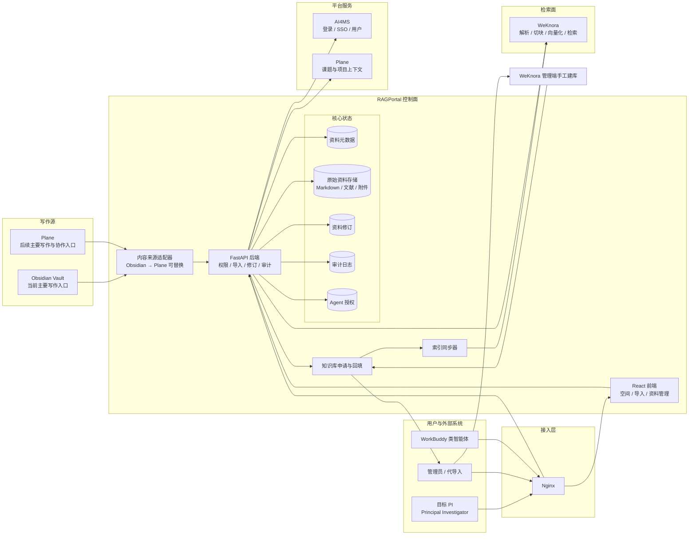
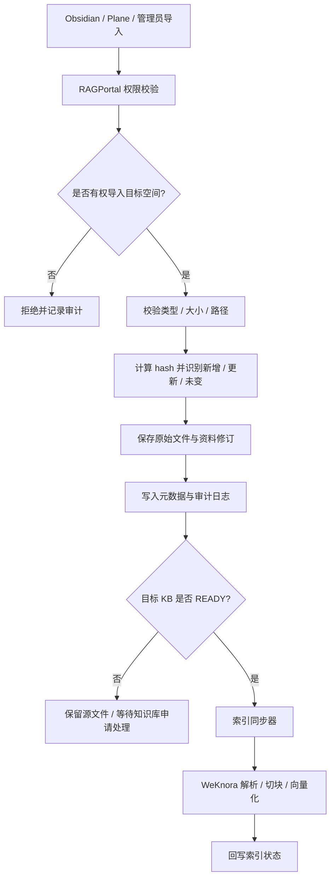
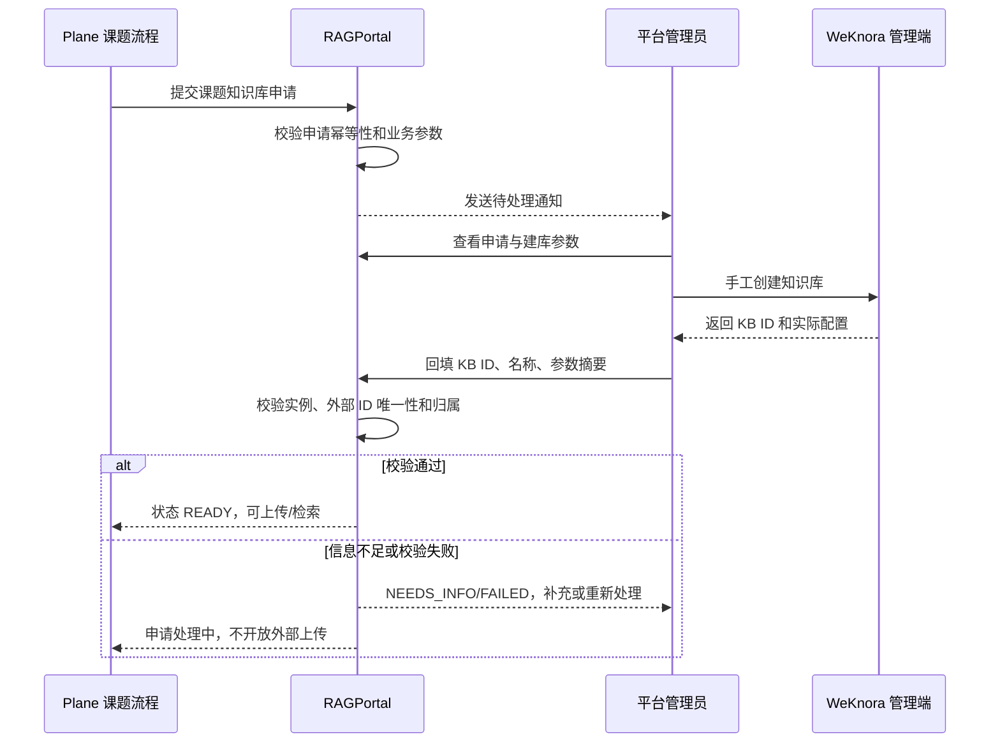
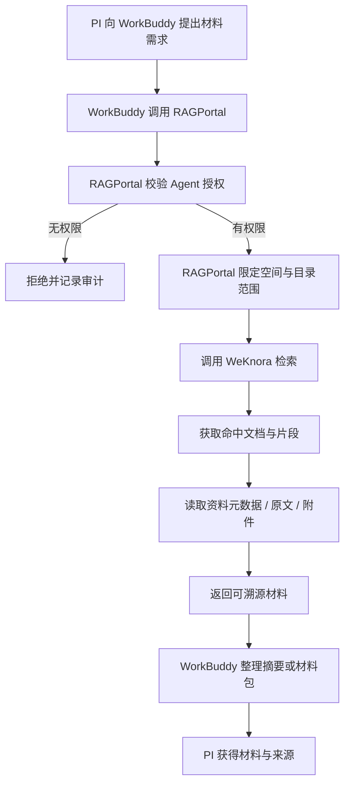

# PI 私有科研资料库与 WorkBuddy 访问网关 PRD

| 项目 | 内容 |
|------|------|
| 文档日期 | 2026-09-24 |
| 文档版本 | v0.4 |
| 产品名称 | RAGPortal PI 私有科研资料库与 Agent 访问网关 |
| 文档类型 | 产品需求文档(PRD) |
| 当前项目 | RAGPortal |
| 主要服务对象 | 目标 PI(Principal Investigator)、平台管理员、WorkBuddy 类授权智能体 |
| 核心依赖 | AI4MS 身份体系、WeKnora 检索服务、Plane 研究项目上下文 |

## 1. 背景与术语

### 1.1 术语约定

- **PI**:本文中的 PI 特指 **Principal Investigator**,即某一位真实的项目负责人。PI 是 AI4MS 中的一个具体人类用户,不是泛化的“研究人员”角色,也不是课题组、组织或系统账号。
- **目标 PI**:一期服务的对象是当前明确指定的某一位 PI。架构上可以预留多个 PI 空间并存的能力,但“支持所有 PI”不是一期验收目标。
- **WorkBuddy 类智能体**:指以 WorkBuddy 为参考接入方的智能体客户端。产品能力不应硬编码为只支持 WorkBuddy;类似 WorkBuddy 的外部智能体都应通过统一的 Agent 身份和独立凭据访问知识库。
- **知识库 / 数据库**:本文中的“数据库”指 PI 的科研资料库和知识资产集合,不是让外部系统直接连接 RAGPortal 数据库实例。
- **写作源**:PI 产生 Markdown 内容的主要工具。当前是 Obsidian,后续规划迁移或并存 Plane。RAGPortal 是写作成果的入库、索引和访问服务,不是写作工具。

### 1.2 当前系统现状

RAGPortal 当前定位是知识库文档上传门户,已经具备:

- 复用 AI4MS 登录与 SSO
- 拉取 WeKnora 知识库列表
- 上传 PDF、DOCX、Markdown 等文件
- 记录上传者、解析状态与研究项目 metadata
- 管理员查看、筛选与导出上传记录

当前明确的知识库创建边界：

- RAGPortal 现有接口**不能直接创建 WeKnora 知识库**。
- RAGPortal 只能创建知识库申请，记录课题、空间、申请人、目标 PI、预期用途和管理员建库所需的业务参数。
- 管理员收到申请通知后，必须根据 WeKnora 的完整建库参数在 WeKnora 管理端手工创建知识库。
- 管理员完成建库后，将 WeKnora 知识库 ID 及实际配置回填 RAGPortal，由 RAGPortal 完成绑定、状态更新和后续上传授权。
- 在绑定状态变为 `READY` 之前，Plane/RAGPortal 不得把该知识库当作可上传目标。

### 1.3 新需求

目标 PI 的实际使用方式进一步明确为:

1. PI 需要一个自己的私有科研资料库，可以保存文献、项目资料、实验材料和 Markdown 笔记；知识库由申请流程和管理员手工建库完成。
2. PI 的日常写作主要发生在 Obsidian 中,后续主要写作与项目协作入口预计迁移到 Plane。
3. WorkBuddy 的核心价值是访问 PI 的资料库,例如 PI 说“把某类材料发我”,WorkBuddy 可以检索、读取并整理相关材料后返回。
4. WorkBuddy 不是主要写作入口,也不应在第一期直接修改 PI 的知识库源文件。

因此,RAGPortal 不需要被改造成 Obsidian,也不应承担完整笔记编辑、双链、图谱或实时协同能力。

## 2. 问题定义

### 2.1 当前模式的限制

当前文件上传后主要由 WeKnora 保存与索引,RAGPortal 只记录上传状态。该模式适合一次性文档入库,但难以支撑以下需求:

- **私有空间边界不完整**:知识库列表主要由全局 WeKnora API Key 决定,RAGPortal 缺少自己的空间级成员与授权模型。
- **写作源资料缺少统一镜像**:PI 的 Obsidian vault、文献和附件分散在本地或不同工具中,WorkBuddy 无法安全地帮 PI 查找和领取材料。
- **WorkBuddy 类智能体无法安全接入**:如果直接复用 WeKnora API Key 或直连数据库,会绕过 PI 的空间权限边界。
- **原始文件不是系统资产**:如果 WeKnora 数据异常或后续更换检索引擎,缺少由 RAGPortal 主导的源文件与修订记录。
- **审计粒度不足**:需要区分空间 owner、实际导入者、代理上传者和外部 Agent。
- **知识库创建依赖人工运维**:WeKnora 建库需要较多参数，当前不能由 RAGPortal 安全代填或直接调用；如果没有申请、通知、回填和状态模型，课题会出现“已有空间但无法入库”的悬空状态。

### 2.2 核心问题

本 PRD 要解决的问题是:

> 如何基于现有 AI4MS、RAGPortal、WeKnora 和 Plane 组件,为目标 PI 构建一个私有科研资料库;写作继续发生在 Obsidian 或后续 Plane 中,RAGPortal 负责资料入库、原始文件保存、检索索引和 WorkBuddy 类智能体的受控访问。

## 3. 产品定位与目标

### 3.1 产品定位

RAGPortal 的定位是:

> PI 的私有科研资料库和 WorkBuddy 类智能体访问网关。

它承担四件事:

1. **保存**:集中保存 PI 的文献、资料、Markdown 和附件。
2. **索引**:将资料交给 WeKnora 解析、切块、向量化和检索。
3. **授权**:决定用户和智能体能访问哪些空间、哪些内容、能执行什么操作。
4. **供给**:让 WorkBuddy 类智能体能够检索、读取、下载并引用这些资料,帮 PI 整理材料。

RAGPortal 不承担:

- PI 的日常写作体验
- Obsidian 替代品
- 笔记双链与图谱编辑
- 实时多人协同编辑
- WorkBuddy 对源资料的直接写入

### 3.2 业务目标

1. 为目标 PI 建立可长期积累的私有科研资料库。
2. 保持 Obsidian 的文件、目录和附件形态,降低导入与导出成本。
3. 让 WorkBuddy 类智能体可以在授权范围内检索和获取 PI 的材料。
4. 让 WorkBuddy 返回材料时能提供清晰来源,避免无依据总结。
5. 保护 PI 的原始资料,避免被索引系统、智能体或后台功能越权访问。
6. 为后续写作入口迁移到 Plane 预留适配层,而不是重构 RAGPortal 核心。

### 3.3 用户目标

| 用户 / 系统 | 目标 |
|------|------|
| PI | 拥有私有、可导入、可检索、可导出的科研资料库;继续在 Obsidian 或 Plane 中写作 |
| 管理员 | 在授权范围内协助 PI 导入和管理资料,且操作可追溯 |
| WorkBuddy 类智能体 | 通过受控入口检索、读取、下载材料,并整理成可溯源的回答或材料包 |
| 研发团队 | 复用现有 RAGPortal、AI4MS、WeKnora 与 Plane 组件,避免重写系统 |

### 3.4 成功指标

一期上线后应满足:

- 目标 PI 默认拥有独立私有空间,其他用户不可见、不可访问。
- 支持从 Obsidian vault 或文件夹批量导入 Markdown 与附件,并保留相对路径。
- WorkBuddy 类智能体只能访问被授权的空间,且访问行为有审计记录。
- WorkBuddy 能根据问题检索资料、获取原文或附件,并返回可溯源引用。
- 原始文件和元数据可以从 RAGPortal 导出或备份。
- WeKnora 索引异常时,可以基于 RAGPortal 保存的原始文件重建索引。

## 4. 用户与场景

### 4.1 用户与外部系统角色

| 角色 | 说明 |
|------|------|
| PI / Space Owner | 目标 Principal Investigator,是单一真实人类用户;作为空间拥有者拥有最高管理权 |
| Space Member | 被授权访问空间的用户,可按只读或读写授权;一期可以暂不开放 |
| Platform Admin | 平台管理员,可在授权范围内代上传或协助管理 |
| Agent Principal | WorkBuddy 类外部智能体身份,通过独立凭据访问指定空间 |
| System Operator | 运维人员,负责备份、监控与索引重建 |

### 4.2 核心场景

#### 场景一:PI 建立私有资料库并申请知识库

创建 `RESEARCH_CHAIN` 课题时，Plane 必须在同一业务流程中创建独立的 Plane Project，并自动向 RAGPortal 提交该课题的独立知识库申请。RAGPortal 只创建申请，不直接创建 WeKnora 知识库。课题和 Plane Project 可以先创建成功，知识库申请状态置为 `PENDING_ADMIN`，管理员完成 WeKnora 手工建库和回填前，课题页显示“知识库申请处理中”，不开放外部 KB 上传和检索。

目标 PI 登录 RAGPortal 后，系统为其创建或绑定默认个人空间。该空间归属于这个具体用户，用于保存文献、资料、Markdown 笔记和附件。课题知识库申请与个人空间申请共用申请、通知、回填和审计模型，但 `RESEARCH_CHAIN` 课题申请为强制动作，不允许由用户跳过。

申请至少记录：

- 空间与课题标识、目标 PI 和申请人
- 知识库名称、用途、资料范围和预期可见成员
- 关联的 Plane workspace、project、research chain 和 chain node 标识
- 管理员在 WeKnora 建库所需的业务参数和补充说明
- 申请时间、当前状态、处理人、处理时间和拒绝/补充原因

管理员收到通知后，在 WeKnora 管理端手工完成建库，再把实际知识库 ID、名称和必要配置回填 RAGPortal。RAGPortal 校验回填对象属于允许的 WeKnora 实例后，将申请置为 `READY`，Plane 才能使用该 KB 上传和检索。

申请状态至少包括：

```text
REQUESTED → PENDING_ADMIN → CREATED_PENDING_BINDING → READY
                         ↘ NEEDS_INFO / REJECTED
```

课题可以在 KB 申请处理期间继续创建和记录研究过程，但知识上传入口必须显示“知识库申请处理中”，不能伪装成上传成功。申请处理完成后，RAGPortal 将外部 KB 绑定状态回传 Plane，Plane 再开放对应课题的上传和检索能力。

#### 场景二:PI 从 Obsidian 导入资料

PI 在 Obsidian 中维护本地 vault。需要让 WorkBuddy 使用这些资料时,PI 可以将 vault、子目录或文件批量导入 RAGPortal。

导入过程应保留:

- Markdown 原文
- 相对目录结构
- frontmatter
- 标签
- 附件路径
- 文件更新时间等基础元数据

RAGPortal 不解析或重建 Obsidian 的全部双链语义,只保证文件形态兼容,便于导出后继续在 Obsidian 中使用。

#### 场景三:管理员代 PI 导入文件

管理员协助整理资料时,可以在 PI 授权的空间内代导入文件。系统记录:

- 空间归属人是 PI
- 实际导入人是管理员
- 导入时间、文件来源、hash 与目标目录

管理员不使用 PI 的账号密码,也不改变文件的归属关系。

#### 场景四:Obsidian 内容更新后重新入库

PI 在 Obsidian 中持续修改笔记。后续导入时,RAGPortal 通过路径和内容 hash 识别新增、更新与删除:

- 新文件:创建资料记录
- 内容变化:生成新的资料修订
- 内容未变:跳过,避免重复索引
- 本地已删除:可选择标记删除或保留历史

一期以手动批量导入和增量识别为主,不要求实时双向同步。

#### 场景五:PI 让 WorkBuddy 发材料

PI 向 WorkBuddy提出需求,例如“把某个课题相关的材料发我”。

流程如下:

```text
PI 提问
  ↓
WorkBuddy 调用 RAGPortal
  ↓
RAGPortal 校验 Agent 授权
  ↓
WeKnora 检索相关资料
  ↓
RAGPortal 合并元数据、原文与附件信息
  ↓
WorkBuddy 整理材料包或摘要,并附来源
  ↓
PI 获得可打开、可核实的材料
```

#### 场景六:WorkBuddy 获取原文和附件

WorkBuddy 不只返回向量检索片段,还应能获取:

- 文档标题、路径和更新时间
- Markdown 原文或 PDF 原文件
- 相关附件
- 命中片段和来源位置

这样 WorkBuddy 可以把材料整理成摘要、清单或附件包发给 PI。

#### 场景七:后续写作入口迁移到 Plane

当 Plane 成为主要写作和项目协作入口后,RAGPortal 增加或替换内容来源适配器:

```text
当前:Obsidian Folder / Vault
后续:Plane Notes / Project Documents
```

RAGPortal 的空间、权限、原始文件、索引映射和 Agent 访问模型保持稳定,不需要因为写作入口变化而重构核心架构。

#### 场景八:资料导出与备份

PI 可以导出整个空间的原始文件、目录结构和必要元数据。导出结果应保持 Markdown 与附件的相对关系,便于继续在 Obsidian、VS Code 或 Plane 相关流程中使用。

## 5. 产品范围

### 5.1 一期范围

一期目标是完成“私有资料库 + 知识库申请/人工建库绑定 + WorkBuddy 只读获取”的最小闭环:

1. 私有空间模型
2. 基础权限与授权边界
3. 文件与文件夹批量导入
4. 保存原始 Markdown、文献和附件
5. 保留相对路径与基础元数据
6. 基于 hash 的增量导入识别
7. 资料修订与索引映射
8. 知识库申请、管理员通知、WeKnora 手工建库回填与绑定状态
9. WeKnora 索引状态同步
10. WorkBuddy 类智能体只读授权
11. 搜索、读取、下载和引用来源链路
12. 基础审计日志

### 5.2 二期范围

二期增强导入与供给能力:

1. Obsidian 目录监听或同步工具
2. Plane 内容来源适配器
3. 文献元数据自动抽取
4. 标签、项目、时间和文件类型的结构化过滤
5. 材料包清单与批量下载
6. 回收站、软删除与恢复
7. 空间级导出与备份校验
8. Agent 配额、限流与更细粒度授权

### 5.3 三期方向

三期可扩展协作与多智能体场景:

1. 课题组共享空间
2. 项目空间与 Plane 课题节点深度关联
3. 多个 WorkBuddy 类智能体的授权管理
4. 更细粒度的目录与资料权限
5. 智能体产出的受控暂存区
6. 知识图谱与实体关系增强

### 5.4 非目标

当前版本明确不包含:

- 把 RAGPortal 做成 Obsidian 替代品
- Markdown 在线编辑器
- 双链编辑、反向链接视图或知识图谱编辑
- 实时多人协同编辑
- Obsidian 与 RAGPortal 的实时双向同步
- WorkBuddy 直接修改 PI 的源资料
- WorkBuddy 直连 SQLite、PostgreSQL、WeKnora 或任何内部数据库
- 直接暴露 WeKnora API Key 给外部系统
- 自动代替 PI 修改正式论文或结论文档

## 6. 总体架构

### 6.1 架构定位

整体架构采用“写作源 / 控制面 / 数据面 / 检索面 / 身份面”分离:

- **写作源**:Obsidian 是当前主要写作入口,Plane 是后续主要写作与协作入口。
- **身份面**:AI4MS 负责登录、SSO、用户身份与基础角色。
- **控制面**:RAGPortal 负责空间、权限、资料元数据、修订、审计与 Agent 授权。
- **数据面**:RAGPortal 管理原始 Markdown、文献、附件与目录结构。
- **检索面**:WeKnora 负责文档解析、切块、向量化和检索执行。

### 6.2 架构图



### 6.3 核心架构原则

1. **写作发生在写作源**
   PI 继续在 Obsidian 中写笔记,后续使用 Plane。RAGPortal 不提供完整写作体验。

2. **RAGPortal 是权限边界**
   用户和 Agent 能访问哪些空间、能读哪些内容、能执行什么操作,均由 RAGPortal 判定。WeKnora 和内部数据库不直接对外。

3. **原始文件归 RAGPortal 保存**
   RAGPortal 的资料存储是 source of truth。WeKnora 中的索引是可重建的派生数据。

4. **入库是单向镜像**
   一期从 Obsidian 或 Plane 导入到 RAGPortal,不把 RAGPortal 的修改回写到写作源,避免出现双向同步冲突。

5. **WeKnora 负责检索执行**
   继续复用 WeKnora 的解析、切块、向量化和搜索能力,一期不引入新的向量数据库。

6. **WorkBuddy 类智能体不直连内部系统**
   WorkBuddy 使用独立授权访问 RAGPortal,由 RAGPortal 代理检索、读取和下载。

7. **知识库创建采用申请加人工回填**
   RAGPortal 现有接口不直接创建 WeKnora 知识库。课题或空间创建后提交知识库申请，管理员根据完整参数在 WeKnora 管理端手工建库，再将外部 KB ID 和配置摘要回填 RAGPortal。RAGPortal 只有在绑定校验通过并进入 `READY` 后才发起上传和检索。

8. **修订先于索引**
   资料导入或更新先落入 RAGPortal 的原始存储与修订记录,再触发索引更新,避免只更新索引而丢失源数据。

9. **审计贯穿访问链路**
   PI、管理员、代理导入者和 Agent 的关键操作都应记录操作者、授权者、目标对象与结果。

## 7. 数据流

### 7.1 导入与索引流程



导入流程必须满足:

- 权限校验失败时不产生任何数据变更。
- 文件保存成功后,元数据、修订与审计信息保持一致。
- 索引失败不影响源文件保存,用户可看到索引失败原因并重试。
- 内容 hash 未变化时避免重复索引。
- 保留导入批次与导入报告,便于排查重复导入或路径错乱。
- 目标知识库未处于 `READY` 时，允许保存源文件和导入申请记录，但不得创建 WeKnora 上传任务；知识库就绪后可由管理员或授权用户重试入库。

### 7.1.1 知识库申请与人工建库流程

课题或空间创建后，系统先提交知识库申请，不直接调用 WeKnora 建库接口：



状态约束：

- `REQUESTED`：申请已提交，等待管理员接收。
- `PENDING_ADMIN`：管理员已收到通知，尚未在 WeKnora 完成建库。
- `CREATED_PENDING_BINDING`：管理员已在 WeKnora 建库并回填，RAGPortal 尚未完成绑定校验。
- `READY`：绑定校验通过，可以由授权用户上传、轮询解析状态和检索。
- `NEEDS_INFO`：参数、建库配置或回填信息不足，等待补充。
- `REJECTED`：申请被拒绝，必须保留原因和审计记录。
- `FAILED`：系统或外部校验失败，可按错误类型重试或人工处理。

RAGPortal 负责申请、通知、状态和回填审计；管理员负责 WeKnora 管理端建库；WeKnora 负责建库后的解析、索引和检索。任何未进入 `READY` 的申请都不能被当作可用知识库。

### 7.2 WorkBuddy 获取材料流程



材料获取结果应至少包含:

- 所属空间
- 资料标识
- 标题或路径
- 命中片段
- 原文或附件获取方式
- 修订或更新时间
- 前端可跳转的来源位置

## 8. 功能需求

### 8.1 私有空间

#### FR-SP-01 默认个人空间

系统应为目标 PI 自动创建个人空间。个人空间默认只有该 PI 可访问。

#### FR-SP-02 空间隔离

用户默认只能看到自己有权限的空间。未授权空间不得出现在列表、搜索结果、统计页面或 API 返回中。

#### FR-SP-03 空间类型

一期优先支持个人空间。数据模型设计应预留共享空间与项目空间能力。

#### FR-SP-04 空间与 WeKnora KB 映射

RAGPortal 空间可以映射到一个或多个 WeKnora KB。映射关系由 RAGPortal 维护，权限判断不依赖 WeKnora 的全局 Key 可见范围。映射只能通过“申请 → 管理员在 WeKnora 手工创建 → 回填绑定”完成，RAGPortal 不直接调用 WeKnora 建库接口。

#### FR-SP-05 课题创建自动申请

创建 `RESEARCH_CHAIN` 课题时，Plane 必须自动提交一个独立的 RAGPortal 知识库申请。申请必须幂等，同一 workspace/project/chain 在未结束的申请期间不得重复创建相同申请。课题创建不得等待管理员完成 WeKnora 建库；课题先以 `PENDING_ADMIN` 状态可用，申请页面和课题页应显示：

- 申请状态和当前处理人
- 申请所需业务参数和缺失项
- 管理员处理说明、补充信息和拒绝原因
- WeKnora 知识库 ID 回填后的绑定结果
- Plane project、research chain 和申请之间的关联

个人空间申请可以由 RAGPortal 管理界面发起，但不能替代 `RESEARCH_CHAIN` 课题创建时的自动申请。

#### FR-SP-06 管理员手工建库回填

AI4MS/Plane 平台管理员收到申请通知后，在 WeKnora 管理端手工创建知识库。管理员负责维护申请通知渠道、处理 SLA、WeKnora 建库参数清单和回填校验规则。RAGPortal 提供回填表单，管理员填写实际 KB ID、名称、建库参数摘要和操作时间。RAGPortal 必须记录申请人、目标 PI、建库管理员、回填人、Plane project/chain 和外部 KB ID，并将状态推进到 `CREATED_PENDING_BINDING` 或 `READY`。

RAGPortal 不保存或展示 WeKnora 管理凭证，不把无法确认的 KB ID 标记为 `READY`。如果回填失败、KB 不存在或已经绑定其他空间，申请进入 `NEEDS_INFO`/`FAILED`，并提供人工处理路径。管理员可以维护申请状态，但不能借管理员身份读取未授权课题正文。

#### FR-SP-07 课题 KB 可见范围继承

课题 KB 的可见范围由课题所属组织架构继承。默认可见主体包括：学生 owner、直接导师、产业化负责人、基础研究负责人和课题组主 PI；组织架构中位于这些负责人上级的领导按组织继承规则可见。课题组主 PI 同时是平台配置中的唯一 `Main PI`，二者不是两个独立身份。

RAGPortal 保存 Plane 传入的组织路径、角色和授权版本，按绑定后的 ACL 过滤 KB、文档、检索结果和下载请求。WeKnora 全局 API key 的可见范围不能扩大上述业务授权。

### 8.2 资料导入

#### FR-IMPORT-01 文件与文件夹导入

支持上传单个文件、多个文件、文件夹或压缩包。导入时必须选择目标空间和目录。

#### FR-IMPORT-02 Obsidian vault 导入

支持导入 Obsidian vault 或其子目录。系统应保留 Markdown、附件和相对路径的对应关系。

#### FR-IMPORT-03 原始文件保存

RAGPortal 必须保存原始文件内容,并在元数据中记录文件类型、大小、hash、路径、来源工具和导入者。

#### FR-IMPORT-04 增量识别

重复导入时,系统应基于路径和内容 hash 识别:

- 新增文件
- 更新文件
- 未变化文件
- 可能删除文件

未变化文件不重复占用修订和索引任务。

#### FR-IMPORT-05 导入批次与报告

每次导入应形成批次记录,展示成功、失败、跳过、更新和新增数量,并保留失败原因。

#### FR-IMPORT-06 附件关联

系统应尽量保留 Markdown 与附件的相对路径关系,并支持按路径、同目录或 frontmatter 识别关联附件。

#### FR-IMPORT-07 基础元数据提取

一期至少提取文件名、扩展名、大小、hash、路径和更新时间。对 Markdown 可解析 YAML frontmatter 与标签作为基础元数据。

#### FR-IMPORT-08 删除与 tombstone

当导入源中某些文件被删除时,系统可以将其标记为已删除或保留历史修订。一期不强制物理删除。

### 8.3 资料管理

#### FR-DOC-01 资料列表

PI 或管理员可以按空间、路径、文件类型、导入时间、索引状态和来源查看资料列表。

#### FR-DOC-02 原文下载

有权限的用户可以下载 Markdown 原文、文献或附件。

#### FR-DOC-03 资料修订记录

每次导入导致的内容变化应形成修订记录,包含内容 hash、导入者、来源工具和导入时间。

#### FR-DOC-04 修订查看

二期支持查看两个修订之间的文本差异。一期只需保留修订数据和可回溯标识。

#### FR-DOC-05 内容导出

支持导出空间原始文件、目录结构与基础元数据。导出结果应保持 Obsidian 兼容的相对路径。

#### FR-DOC-06 不提供在线编辑

一期和二期均不提供 Markdown 在线编辑器。资料修改应回到 Obsidian 或后续 Plane 中完成,再重新导入。

### 8.4 检索与材料供给

#### FR-RAG-01 空间内检索

用户和 Agent 只能在自己有权限的空间内发起检索。

#### FR-RAG-02 语义检索

一期复用 WeKnora 检索能力,返回语义检索结果。二期补充文件名、路径、标签和元数据过滤。

#### FR-RAG-03 原文与附件获取

检索命中后,WorkBuddy 类智能体可以在授权范围内获取原文、附件和基础元数据,而不仅是向量片段。

#### FR-RAG-04 索引状态展示

资料应显示索引状态,例如待索引、索引中、成功、失败。

#### FR-RAG-05 索引重试

索引失败后,有权限的用户可以触发重试。

#### FR-RAG-06 结果溯源

WorkBuddy 返回材料或摘要时,必须能标识来源文档、路径、片段或附件,不允许只返回无来源的生成内容。

#### FR-RAG-07 索引可重建

当索引异常或迁移检索引擎时,可以基于 RAGPortal 保存的原始文件重建索引。

### 8.5 WorkBuddy 类智能体接入

> RAGPortal 的 WorkBuddy 类 Agent 仍保持资料只读授权。Plane 研究链中的主 PI/直接导师 review Agent 属于 Plane/Synlora 的另一层能力，评论和分析结果草稿由 Plane 保存，不扩展 RAGPortal WorkBuddy 的源资料写权限。

#### FR-AGENT-01 通用智能体接入模型

PI 可以创建、查看、暂停和撤销 WorkBuddy 类智能体的空间访问授权。接入模型应支持同类智能体,不得把授权能力硬编码为仅服务 WorkBuddy。

#### FR-AGENT-02 WorkBuddy 一期只读

RAGPortal 面向 WorkBuddy 类外部智能体的一期授权只包含检索、读取元数据、读取原文和下载附件，不包含写入源资料、写入课题事件、提交分析结果或修改 KB 成员。

#### FR-AGENT-03 独立凭据

WorkBuddy 类智能体使用独立 Agent 凭据访问 RAGPortal,不得复用 PI 登录态或 WeKnora 全局 API Key。

#### FR-AGENT-04 授权范围

授权应绑定空间,并预留目录、文件类型、有效期和操作范围限制。

#### FR-AGENT-05 材料整理

WorkBuddy 可以基于 RAGPortal 返回的检索结果、原文和附件整理材料包、摘要或答复,但整理结果默认不属于 RAGPortal 源资料。

#### FR-AGENT-06 操作留痕

WorkBuddy 类智能体的每次关键访问行为都应记录审计信息,包括检索、读取原文和下载附件。

#### FR-AGENT-07 结果可信

WorkBuddy 面向 PI 输出内容时,应能标识引用来源,避免无依据总结。

### 8.6 审计与安全

AI4MS 与 Plane 的账号绑定采用真实 OIDC/SSO：登录由 AI4MS 身份提供方完成，Plane 通过稳定的 external subject 建立 AccountLink；绑定、解绑、撤权、subject 冲突和登录失败均写入审计。RAGPortal 不接收或展示 AI4MS/Plane 密码，不通过邮箱自动合并账号；OIDC 不可用时必须显示明确的未配置状态，不得伪造绑定成功。

#### FR-AUD-01 审计事件

至少记录以下事件:

- 空间创建与配置变更
- 成员与 Agent 授权变更
- 文件导入、更新、标记删除
- 导入批次执行
- 检索访问
- 原文和附件下载
- 授权失败与拒绝访问

#### FR-AUD-02 双身份记录

代导入和 Agent 访问必须同时记录授权主体与实际操作主体。

#### FR-AUD-03 审计查询

管理员或空间 Owner 可以按时间、空间、用户、Agent 与操作类型查询审计记录。

#### FR-SEC-01 私密性

未经授权,任何用户、Agent 或后台功能不得读取 PI 私有空间内容。

#### FR-SEC-02 禁止直连数据库

WorkBuddy 不得直连 SQLite、PostgreSQL、WeKnora 或其他内部数据库,只能通过 RAGPortal 的受控服务边界访问。

#### FR-SEC-03 密钥隔离

WeKnora API Key 仅保存在 RAGPortal 后端配置中,不得暴露给前端、WorkBuddy 类智能体或普通用户。

#### FR-SEC-04 备份要求

元数据库与原始资料存储必须纳入备份计划,并支持恢复验证。

## 9. 数据需求

### 9.1 核心概念

一期数据模型应包含以下核心概念:

| 概念 | 说明 |
|------|------|
| Space | 权限与内容隔离的基本单位 |
| Space Member | 空间成员与角色 |
| Source Document | 资料或笔记的逻辑对象 |
| Source Path | 资料在空间内的相对路径 |
| Source Revision | 资料修订与内容 hash |
| Attachment | 与资料关联的附件 |
| Import Run | 一次导入批次 |
| Agent Token | WorkBuddy 类外部智能体授权凭据 |
| Audit Event | 审计事件 |
| Index Mapping | 资料与 WeKnora knowledge 的映射 |
| Knowledge Base Request | 知识库申请、管理员处理、人工建库回填与状态 |
| Knowledge Base Binding | RAGPortal 空间/课题与已创建 WeKnora KB 的绑定 |

### 9.2 存储策略

- 元数据存放在关系型数据库,当前可继续使用 SQLite,并发提升后迁移 PostgreSQL。
- 原始文件保存在本地持久化目录或对象存储。
- 当前文件用于读取和下载,历史修订用于追溯。
- 文件 hash 用于去重与索引更新判断。
- WeKnora 返回的 knowledge 标识只作为索引映射,不作为源文件唯一标识。

### 9.3 Obsidian 兼容目录

```text
spaces/{space_id}/
  00-inbox/
  10-projects/
  20-literature/
  30-meetings/
  40-ideas/
  90-archive/
  attachments/
```

目录结构可由用户调整,但系统应保持相对路径稳定,便于导出和 Obsidian 兼容。

## 10. 非功能需求

### 10.1 性能

- 批量导入不应阻塞用户界面,应展示批次进度。
- 索引可采用异步或懒同步方式处理。
- 资料列表、检索结果和审计列表必须分页。
- 常用空间列表、权限判断和文件元数据查询应避免高频远端调用。

### 10.2 可用性

- WeKnora 不可用时,不应影响 PI 或管理员继续导入和保存原始资料。
- 索引失败应可重试,并向用户展示明确状态。
- 系统应支持从原始文件重建索引。

### 10.3 可维护性

- 保持 FastAPI 单体应用与模块化服务分层,暂不拆微服务。
- WeKnora 访问集中在后端客户端模块,便于适配接口变化。
- 内容来源适配器应隔离 Obsidian、Plane 和其他来源的差异。
- 数据库访问继续使用 SQLAlchemy,便于 SQLite 向 PostgreSQL 迁移。

### 10.4 安全与合规

- 所有私有空间访问必须经过服务端权限校验。
- Agent 凭据只保存摘要或加密后的 secret。
- 上传文件需校验类型、大小与路径,避免路径穿越。
- 解压缩导入需防范 zip bomb、非法路径和超深层目录。
- 日志中不得输出文件正文、API Key 或用户凭据。

### 10.5 备份与恢复

- 元数据库与资料目录必须定期备份。
- 备份应包含资料、附件、修订历史与必要元数据。
- 需要定期验证恢复流程,而不只是生成备份文件。

## 11. 交互与体验原则

RAGPortal 的界面应定位为安静、克制、学术、可信的资料库管理界面:

- 以排版、留白、对齐和信息分组组织界面,不依赖装饰性图形。
- 层级来自字号、字重、间距和微妙分隔线,而不是大量彩色卡片。
- 空间、导入批次、资料列表、索引状态和授权管理应有清晰主次。
- 导入进度、失败原因和索引状态使用明确、朴素的表达。
- 不提供笔记编辑器,避免让用户误以为 RAGPortal 替代 Obsidian。
- 在合适位置说明推荐流程:Obsidian 写作 → RAGPortal 入库 → WorkBuddy 使用。

## 12. 技术方案摘要

### 12.1 复用现有组件

| 组件 | 继续承担的职责 |
|------|----------------|
| AI4MS | 登录、SSO、用户身份、基础角色 |
| Obsidian | 当前主要写作源,继续负责 Markdown、双链和本地笔记体验 |
| Plane | 后续主要写作与项目协作入口,并提供课题上下文 |
| RAGPortal Frontend | 空间、导入、资料列表、索引状态与授权管理 |
| RAGPortal Backend | 空间权限、导入、资料修订、审计、Agent 授权、WeKnora 代理 |
| SQLite / SQLAlchemy | 一期元数据存储 |
| WeKnora | 文档解析、切块、向量化和检索 |
| Nginx + PM2 | 继续沿用当前部署方式 |

### 12.2 不新增的重型组件

一期不引入:

- Qdrant / Milvus 等新向量数据库
- Celery / Redis 任务队列
- 微服务拆分
- 实时协同编辑引擎
- Obsidian 替代编辑器

原因:

- 当前 WeKnora 已承担解析与检索能力。
- 一期目标是打通权限、源文件、导入修订和 Agent 边界。
- 索引同步可先采用应用内异步任务或现有懒同步机制。

### 12.3 演进路径

当以下条件出现时再演进:

| 条件 | 演进方向 |
|------|----------|
| 多用户并发导入明显增加 | SQLite 迁移 PostgreSQL |
| 文件规模或备份要求提升 | 本地目录迁移 MinIO / S3 |
| 索引任务排队明显 | 引入独立 Worker 与队列 |
| 检索能力不满足需求 | 在 WeKnora 之外补充关键词索引或元数据索引 |
| Plane 成为稳定写作源 | 实现 Plane Source Adapter |
| 智能体产出需要沉淀 | 设计受控暂存区,而非直接改源资料 |

## 13. 实施阶段

### 13.1 阶段一:私有空间与导入闭环

目标:

- 建立空间与权限模型
- 目标 PI 默认拥有个人空间
- 支持文件和文件夹批量导入
- 保存原始 Markdown、文献与附件
- 建立资料修订与导入批次记录

验收重点:

- 未授权用户无法看到或访问 PI 空间
- Obsidian 导入后保留相对路径和附件关系
- 重复导入能识别新增、更新和未变化文件

### 13.2 阶段二:课题自动申请、人工建库绑定与索引供给闭环

目标:

- 建立知识库申请、管理员通知、手工建库回填与绑定状态
- 建立资料与 WeKnora knowledge 的映射
- 同步解析与索引状态
- 支持检索、原文读取和附件下载
- 支持索引失败重试与重建

验收重点:

- `RESEARCH_CHAIN` 课题创建时自动创建 Plane Project 并生成唯一知识库申请，课题先进入 `PENDING_ADMIN`
- AI4MS/Plane 管理员收到通知并能在 WeKnora 手工建库后回填，回填校验通过后课题进入 `READY`
- 未达到 `READY` 前不允许上传到外部 KB，但源文件和人工记录不丢失
- 学生、直接导师、产业化负责人、基础研究负责人、课题组主 PI 及组织架构上级领导按继承规则访问课题 KB
- 源文件丢失索引后可重建
- 索引失败不影响源文件保存
- 检索结果能定位到资料与片段

### 13.3 阶段三:WorkBuddy 只读接入

目标:

- 建立 Agent 授权模型
- WorkBuddy 可在授权范围内检索、读取和下载
- 返回材料时带来源信息
- Agent 访问留审计

验收重点:

- WorkBuddy 无法访问未授权空间
- 撤销授权后立即失效
- WorkBuddy 能根据 PI 需求整理并返回材料

### 13.4 阶段四:Plane 与同步增强

目标:

- 增加 Plane 内容来源适配器
- 优化 Obsidian 增量同步体验
- 支持结构化过滤、材料包清单和批量下载
- 完善导出、回收站与备份校验

验收重点:

- 写作入口从 Obsidian 迁移或并存 Plane 时,RAGPortal 核心模型不变
- PI 可以持续将最新写作成果导入资料库供 WorkBuddy 使用

## 14. 验收标准

### 14.1 权限验收

- PI 可以访问自己的个人空间。
- 未授权普通用户无法在列表、详情、搜索和后台导出中看到该空间内容。
- 管理员代导入必须通过授权目标空间,并记录实际操作者。
- WorkBuddy 使用独立凭据访问,且无法越权访问其他空间。

### 14.2 导入验收

- 支持批量导入 Markdown、文献和附件。
- 导入后保留相对路径与 frontmatter 等基础信息。
- 重复导入能识别未变化文件并跳过无意义索引。
- 内容变化生成新修订。
- 导入批次能展示成功、失败、更新和跳过结果。

### 14.3 材料供给验收

- WorkBuddy 可以在授权范围内检索资料。
- WorkBuddy 可以获取命中资料的原文或附件。
- WorkBuddy 返回摘要或材料包时能提供来源。
- PI 可以根据来源回到 RAGPortal 查看或下载原文件。

### 14.4 索引验收

- 文档导入或更新后会触发或排队索引更新。
- 索引状态可见,失败可重试。
- 删除或标记删除后,检索结果不再返回不可用内容。
- 可以从原始文件重建索引。

### 14.5 审计验收

- 关键导入、读取、下载和授权事件均有审计记录。
- 审计记录能区分 PI、管理员、普通成员和 Agent。
- 授权失败与越权尝试可被查询。

### 14.6 可靠性验收

- WeKnora 不可用时,资料导入和保存不受影响。
- 元数据库与资料目录可恢复。
- Obsidian 导出结果可继续在本地工具中使用。
- 管理员暂未完成手工建库时，申请、通知、补充信息和人工记录可持续追踪；建库完成后可继续入库，不产生重复 KB 或重复上传。

## 15. 风险与应对

| 风险 | 影响 | 应对策略 |
|------|------|----------|
| 把产品误做成 Obsidian 替代品 | 范围失控且无法超过成熟笔记工具 | 明确写作源在 Obsidian / Plane,RAGPortal 只做资料库、索引与访问网关 |
| Obsidian 导入路径和附件关系复杂 | 材料引用断裂 | 保留相对路径、附件目录和导入批次报告;先支持文件夹导入,再做自动同步 |
| WeKnora 缺少稳定更新或删除能力 | 文档更新后索引可能滞后 | 先采用删除后重建或重新上传策略,并保留源文件与修订;后续适配 WeKnora 增量能力 |
| WeKnora 建库参数复杂且只能人工操作 | 课题空间已创建但无法入库,或误绑定错误 KB | RAGPortal 只做申请、通知、状态和回填;管理员在 WeKnora 手工建库后才允许绑定为 `READY`;回填时校验外部 ID 唯一性和空间归属 |
| 管理员处理申请延迟 | 用户误以为上传失败或重复提交申请 | 显示 `PENDING_ADMIN` 状态、处理人、通知时间和补充信息入口;同一课题未结束申请幂等 |
| 手工回填信息不完整 | Plane 上传到错误或未准备好的 KB | 回填必填外部 KB ID、名称和参数摘要;状态先为 `CREATED_PENDING_BINDING`,验证通过后才变为 `READY` |
| SQLite 并发写入瓶颈 | 高频导入时可能出现锁等待 | 一期开启 WAL 与短事务;并发增大后迁移 PostgreSQL |
| 全局 WeKnora API Key 权限过宽 | 存在越权风险 | RAGPortal 强制空间级授权过滤,后续争取 WeKnora scoped key 或租户级凭据 |
| Agent 返回无来源材料 | PI 无法核实结论 | API 返回资料路径、片段和来源,WorkBuddy 输出必须携带引用 |
| 压缩包或批量导入滥用 | 存储和索引压力过大 | 限制文件数、总大小、层级和解压耗时,形成批次报告 |
| 写作入口迁移 Plane 后接口不稳定 | 同步方案返工 | 通过 Source Adapter 隔离 Plane 差异,核心空间与资料模型不变 |

## 16. 开放问题

1. 一期 Obsidian 导入采用网页文件夹上传、压缩包上传,还是本地同步脚本?
2. 是否需要在第一期支持自动监听 Obsidian vault,还是仅手动批量导入?
3. WeKnora 是否提供稳定的文档更新、删除和增量索引能力?
4. WeKnora 手工建库所需的完整参数清单、管理员通知渠道、处理 SLA 和回填校验接口是什么?
5. 管理员拒绝或要求补充信息时,是否需要 PI/课题负责人确认后才能重新提交?
6. WeKnora 是否支持按知识库或租户隔离的 scoped API Key?
7. WorkBuddy 获取材料时,是否需要服务端直接生成材料包清单或 ZIP?
8. Plane 后续提供的内容形式是页面、文档、评论还是附件,同步粒度如何定义?
9. 文件配额、修订数量和回收站保留周期如何设定?
10. 是否需要为文献 PDF 自动抽取元数据并与 Markdown 笔记建立关联?

## 17. 结论

本需求的技术路线是:

> 继续使用现有 RAGPortal + AI4MS + WeKnora 架构，将 RAGPortal 升级为目标 PI 的私有科研资料库和 Agent 访问网关：写作继续发生在 Obsidian，后续由 Plane 承担；RAGPortal 负责空间、知识库申请、管理员通知、手工建库回填、绑定状态、资料导入、原始文件保存、修订、审计、索引映射和 Agent 授权；WeKnora 继续负责管理员手工创建后的解析与检索；WorkBuddy 类智能体只通过 RAGPortal 的受控授权检索和获取材料。

该方案避免把 RAGPortal 改造成 Obsidian,同时满足目标 PI 的核心诉求:继续使用熟悉的写作工具,让 WorkBuddy 安全、可溯源地访问并整理这些资料。


## 18. 变更记录

| 版本 | 日期 | 变更 |
| --- | --- | --- |
| v0.4 | 2026-09-25 | 明确 RESEARCH_CHAIN 课题强制创建独立 Plane Project 并自动提交 KB 申请；补充 PENDING_ADMIN、唯一 Main PI、组织继承可见范围、管理员维护职责、真实 OIDC/SSO 和 Plane review Agent 与 WorkBuddy 只读边界 |
| v0.3 | 2026-09-25 | 明确 RAGPortal 不直接创建 WeKnora 知识库；新增知识库申请、管理员通知、WeKnora 手工建库回填、绑定状态、失败补偿和验收流程 |
| v0.2 | 2026-09-24 | 初始 PRD |
